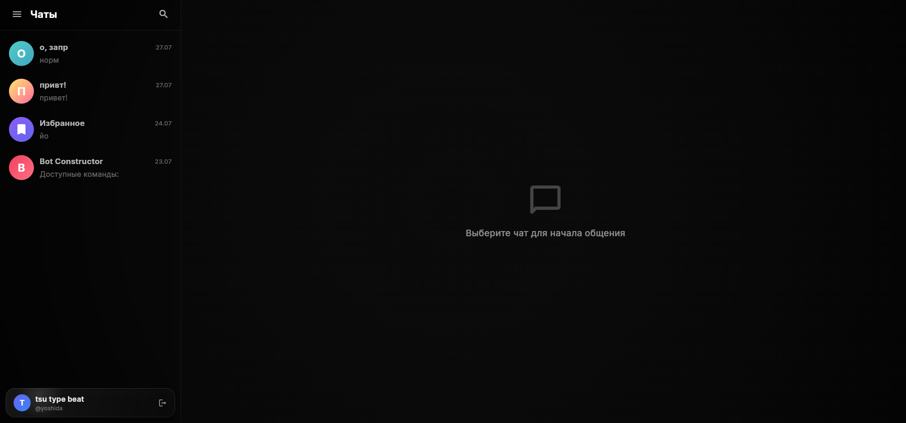
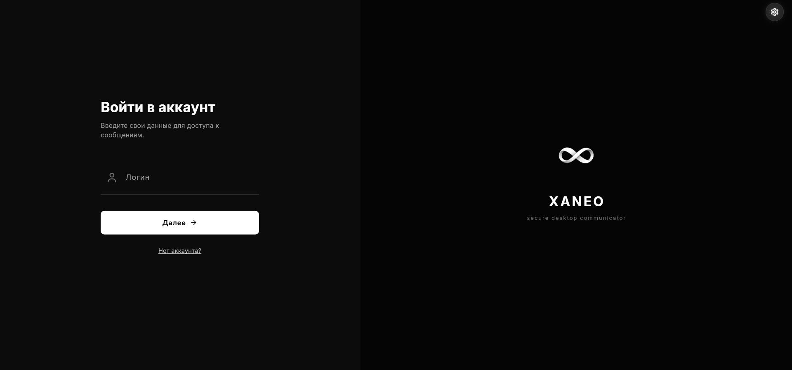
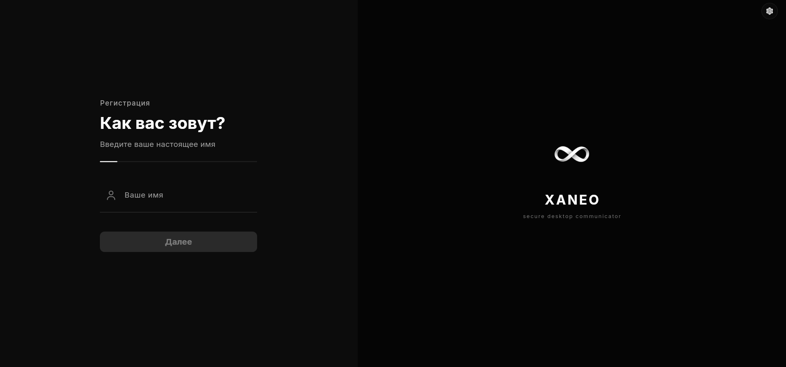

# Xaneo PC

<div align="center">


### **Современный кроссплатформенный десктопный клиент на Flutter**

[](https://flutter.dev)
[](https://dart.dev)
[](LICENSE)
[](https://github.com/xaneorepos/xaneo_pc/stargazers)
[](https://github.com/xaneorepos/xaneo_pc/network/members)
[](https://github.com/xaneorepos/xaneo_pc/issues)

[](https://github.com/xaneorepos/xaneo_pc)

</div>

---

## 📌 О проекте

**Xaneo PC** — это высокопроизводительное десктопное приложение-мессенджер, написанное на **Flutter** и **Dart**. Проект сочетает в себе встроенное сквозное шифрование, видео/аудио звонки реального времени (WebRTC / LiveKit), гибкие сетевые протоколы (gRPC / WebSockets / REST), стильный тёмный дизайн с 3D-параллакс эффектами и глубокую интеграцию с операционными системами (Linux, Windows, macOS).

> **Примечание:** Это десктоп-клиент экосистемы Xaneo.

---

## 📥 Загрузка и Релизы

Готовые сборки и установочные пакеты для различных операционных систем доступны в разделе **[GitHub Releases](https://github.com/xaneorepos/xaneo_pc/releases)**.

---

## 🖼 Скриншоты

### Мессенджер

*Главный экран мессенджера — интерфейс чатов, диалогов, настроек профиля и сообщений*

### Экран входа

*Минималистичный экран авторизации*

### Экран регистрации

*Форма создания нового аккаунта*

---

## 🌟 Основные возможности

- 💬 **Полноценный Мессенджер**:
  - Сообщения, диалоги и чаты с динамической загрузкой.
  - Голосовые сообщения (запись через `record`, воспроизведение через `just_audio` и `media_kit`).
  - Передача файлов, аватарок и медиаданных.

- 📞 **Голосовые и Видеозвонки (WebRTC & LiveKit)**:
  - Интеграция `livekit_client` и WebRTC для качественных групповых и личных звонков с низкой задержкой.

- 🔒 **Криптография и Безопасность**:
  - Шифрование сообщений и данных с использованием алгоритмов **Argon2**, **X25519** и **PointyCastle** (`cryptography`).

- 🪟 **Нативная Desktop-интеграция**:
  - Кастомный стильный заголовок окна (`window_manager`).
  - Поддержка многооконного режима (`desktop_multi_window`).
  - Системные и оверлей-уведомления (`local_notifier` и нативный оверлей).

- 🎨 **Современный UI/UX & Дизайн**:
  - Чёрно-белая и тёмная премиум-тема.
  - Интерактивные 3D-карточки с эффектом параллакса при движении мыши.
  - Фон с анимированными физическими частицами.
  - Lottie-анимации и векторная графика (SVG).
  - Поддержка графического движка **Impeller**.

- 🌐 **Локализация (i18n)**:
  - Встроенная поддержка русского и английского языков.

---

## 🛠 Технологический стек

### Core & Framework
| Технология | Описание |
| :--- | :--- |
| **Flutter 3.x** | Кроссплатформенный UI фреймворк |
| **Dart SDK ^3.9.0** | Основной язык разработки |
| **Provider** | Управление состоянием (State Management) |

### Сеть и Протоколы (Networking)
| Технология | Описание |
| :--- | :--- |
| **gRPC & Protobuf** | Высокопроизводительные RPC-запросы |
| **WebSockets** | Двунаправленный обмен сообщениями в реальном времени |
| **Dio & Http** | REST API клиенты с менеджером сессий и cookies (`cookie_jar`) |

### Звонки & Медиа (Media & Calls)
| Технология | Описание |
| :--- | :--- |
| **LiveKit Client & WebRTC** | Видео- и аудиосвязь в реальном времени |
| **MediaKit & JustAudio** | Проигрывание аудио/видео с нативными библиотеками |
| **Record & Camera** | Запись голосовых сообщений и работа с камерой |

### Безопасность & Криптография
| Технология | Описание |
| :--- | :--- |
| **Cryptography / PointyCastle** | Поддержка стойких криптографических примитивов |
| **Argon2 & X25519** | Хеширование паролей и генерация ключей обмена |

### Desktop Integration & UI
| Технология | Описание |
| :--- | :--- |
| **Window Manager** | Управление окнами, рамками и кастомным TitleBar |
| **Desktop Multi Window** | Работа с несколькими окнами приложения |
| **Local Notifier** | Системные push-уведомления ОС |
| **Lottie & Flutter SVG** | Векторные и Lottie анимации |
| **FastForge** | Инструмент сборки пакетов под Linux & Windows |

---

## 🚀 Запуск и Сборка

### Требования
- Flutter SDK (3.x+)
- Dart SDK (^3.9.0)
- CMake, Ninja, C++ compiler (для сборки desktop-приложений)

### Запуск в режиме разработки

```bash
# Установка зависимостей
flutter pub get

# Запуск на Linux
flutter run -d linux

# Запуск на Windows
flutter run -d windows

# Запуск на macOS
flutter run -d macos
```

#### Запуск с графическим движком Impeller
```bash
./run_with_impeller.sh
```

### Сборка релизных пакетов

#### Обычная сборка
```bash
flutter build linux --release
flutter build windows --release
flutter build macos --release
```

#### Сборка всех дистрибутивов через скрипт
```bash
./build_flutter_packages.sh
```

---

## 📈 Динамика звёзд (Star History)

[](https://star-history.com/#xaneorepos/xaneo_pc&Date)

---

## 📄 Лицензия

Проект распространяется под лицензией **MIT License**. Подробнее см. в файле [LICENSE](LICENSE).

<div align="center">
  <sub>Created with ❤️ by <a href="https://github.com/xaneorepos">Xaneo Repos</a></sub>
</div>
